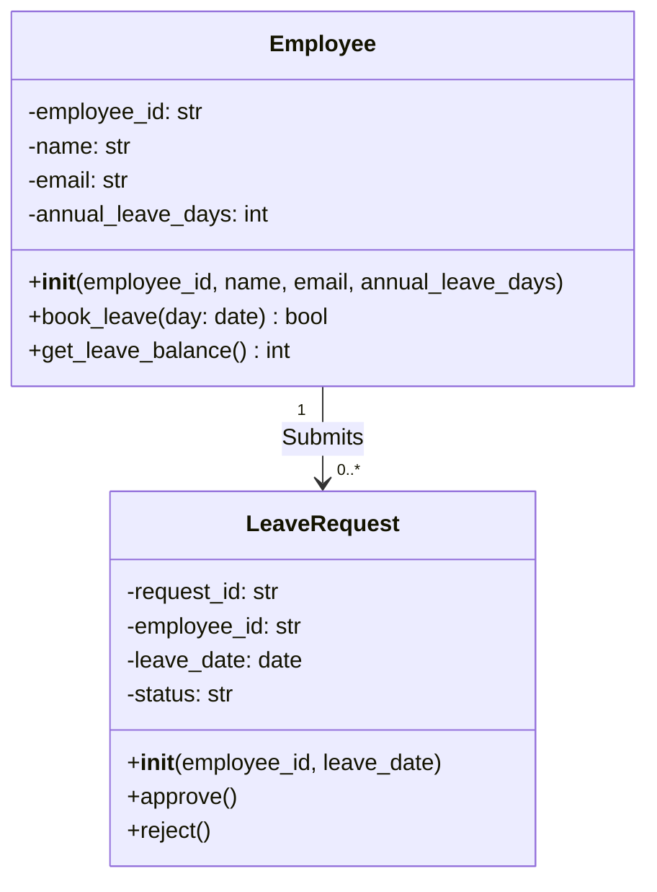

```mermaid
classDiagram  
    class Employee {  
        -employee_id: str  
        -name: str  
        -email: str  
        -annual_leave_days: int  
        +__init__(employee_id, name, email, annual_leave_days)  
        +book_leave(day: date) bool  
        +get_leave_balance() int  
    }  

    class LeaveRequest {  
        -request_id: str  
        -employee_id: str  
        -leave_date: date  
        -status: str  
        +__init__(employee_id, leave_date)  
        +approve()  
        +reject()  
    }  

    Employee "1" --> "0..*" LeaveRequest : Submits  
```